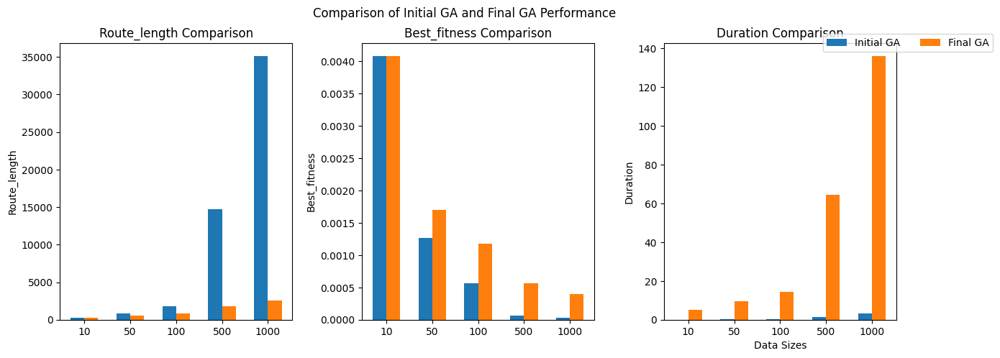
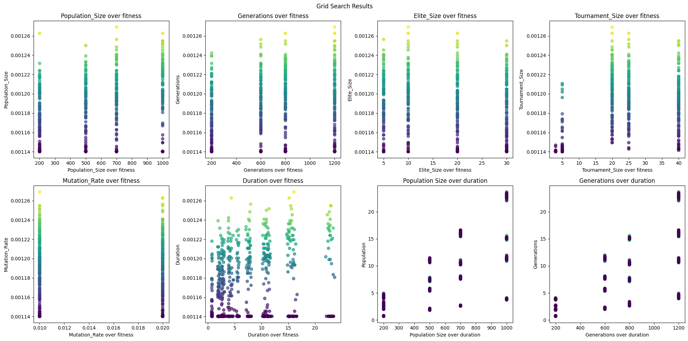
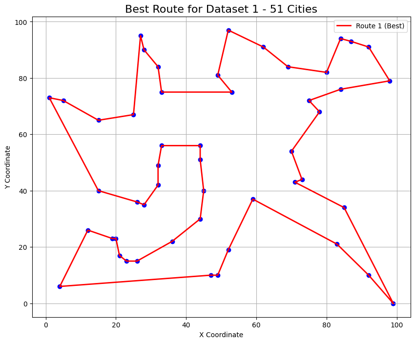
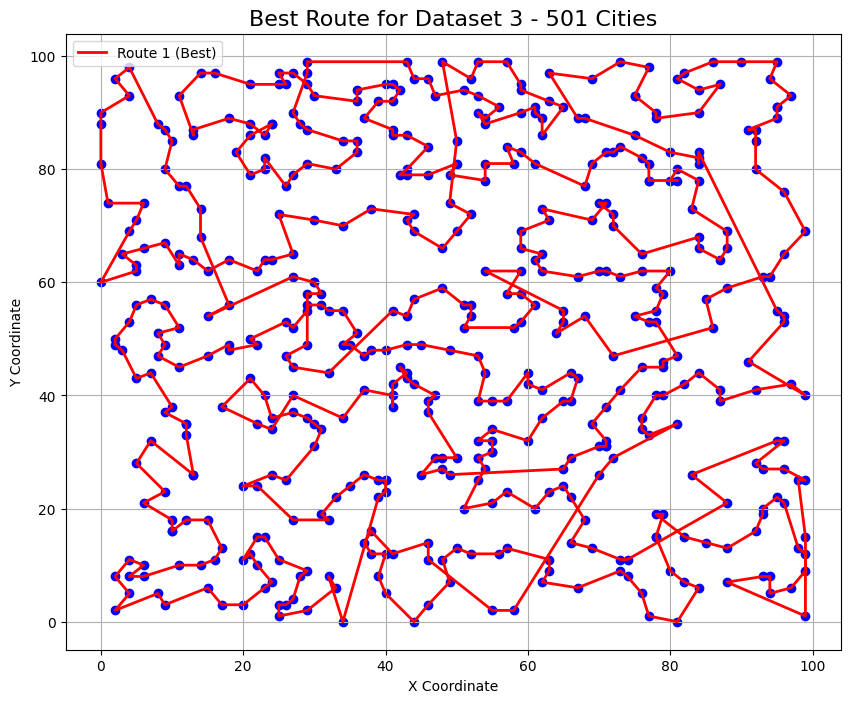

# Ai assignment

## Authors

- Ludvig Svensson
- Noufa Haneefa
- Sami Noroozi
- Viktor Hellgreen
- Raphael Camblong

## Results
For more details on the implementation, testing, and comparisons, check the Jupyter notebooks:
- [tsp.ipynb](src/tsp.ipynb): Explanation of the TSP and GA implementation.
- [st70_comparison.ipynb](tests/st70_comparison.ipynb): Comparison of the algorithm's performance on the st70 dataset.
- [original_vs_final_GA.ipynb](tests/original_vs_final_GA.ipynb): Comparison between the initial and final versions of the GA.
- [crossoverTest.ipynb](tests/crossoverTest.ipynb): Tests for the crossover function in the GA.

# Run
   To run a sample program of the ga TSP algorithm, run the following command:
   ```bash
   cd src && python3 main.py
   ```
# Installation

## Python Virtual Environment Setup Guide

Quick steps to create, activate, and manage Python virtual environments (`venv`) on Linux/macOS and Windows.

### Prerequisites
- Ensure Python is installed:
  - Check version: `python --version` (Windows) or `python3 --version` (Linux/macOS).

### Linux/macOS Steps
1. **Create Virtual Environment**:
   ```bash
   python3 -m venv venv
2. **Activate**:
   ```bash
   source venv/bin/activate
3. **Install dependencies**:
   ```bash
   pip install -r requirements.txt
4. **Deactivate**:
   ```bash
   deactivate

### Windows Steps
1. **Create Virtual Environment**:
   ```bash
   python -m venv venv
2. **Activate**:
   ```bash
   venv\Scripts\activate
3. **Install dependencies**:
   ```bash
   pip install -r requirements.txt
4. **Deactivate**:
   ```bash
   deactivate

# Results




## Exemple

<p float="left">
  
  
</p>
